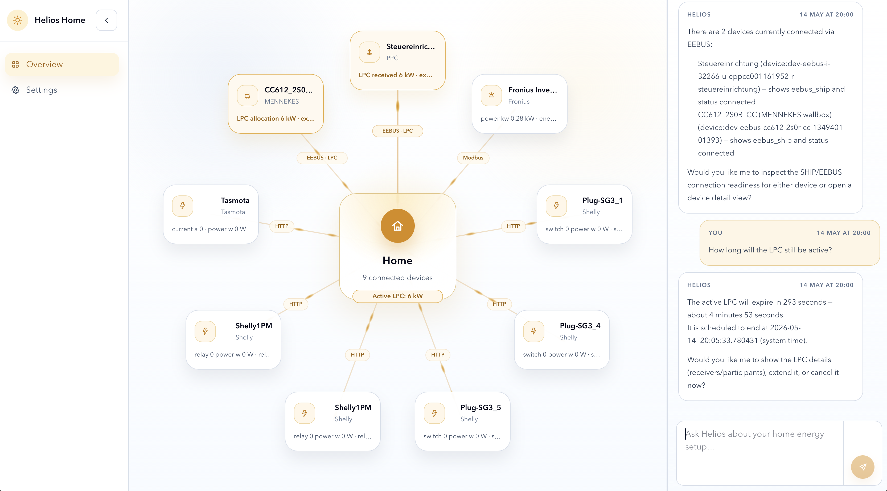

# ☀️ Helios Home

**Helios Home is an agent-first, local-first Home Energy Management System for discovering, commissioning, and safely coordinating energy devices in the home.**

It turns heterogeneous local protocols such as HTTP, mDNS/SSDP, Modbus/SunSpec, and EEBus/SHIP into a canonical, auditable HEMS model. A conversational assistant guides setup, proposes actions, and explains the system, while deterministic backend workflows handle discovery, validation, planning, and guarded dispatch.

Helios is designed around one principle:

> The agent is the operator. The runtime is the safety-critical lab.



## Why Helios Home?

Home energy systems are becoming more complex: PV inverters, batteries, wallboxes, heat pumps, smart meters, EEBus devices, Modbus devices, vendor APIs, and local network protocols all need to work together.

Today, much of that integration is still manual, brittle, and installer-heavy.

Helios explores a different architecture: an agent-first HEMS runtime where the assistant helps users and installers discover, understand, bind and explain devices, while deterministic backend workflows enforce safety, provenance and control boundaries.

## Architecture

```text
Local protocols
HTTP / mDNS / SSDP / Modbus / SunSpec / EEBus
        │
        ▼
Discovery evidence
        │
        ▼
Candidate normalization and reconciliation
        │
        ▼
Local inventory
Device records / discovery runs / canonical assets
        │
        ├──► Agent workspace
        │     Conversation / proposals / setup profile
        │
        └──► HEMS core
              Canonical assets / planning / guarded dispatch / audit
```

## What works today

- Local device discovery via HTTP, mDNS/SSDP, Modbus/SunSpec and EEBus/SHIP
- Candidate reconciliation across multiple local evidence sources
- Persistent local inventory in SQLite
- Conversational setup flow with streamed assistant activity
- Confirmation-gated setup actions
- Canonical HEMS asset model
- Rolling-horizon optimization with CVXPY/HiGHS
- Guarded dispatch with audit records
- EEBus LPC/LPP limits mapped into HEMS import/export constraints

## Current boundaries

Helios is currently an experimental local runtime and research prototype, not a production-ready household energy controller.

Not yet included:

- production-grade installer workflows
- production credential and certificate lifecycle management
- broad production device actuation coverage
- cloud sync or multi-user household sync
- certified safety-critical control behavior

## Quickstart

### Requirements

- Python 3.12+
- Node.js / npm, or the repository-provided local tooling if available
- Linux/macOS recommended for local network discovery

### Run backend

```bash
./scripts/setup-backend.sh
./scripts/run-backend.sh
```

Backend: [http://127.0.0.1:8000](http://127.0.0.1:8000)

### Run frontend

```bash
cd apps/web-ui
npm install
npm run dev
```

Frontend: [http://127.0.0.1:5173](http://127.0.0.1:5173)
